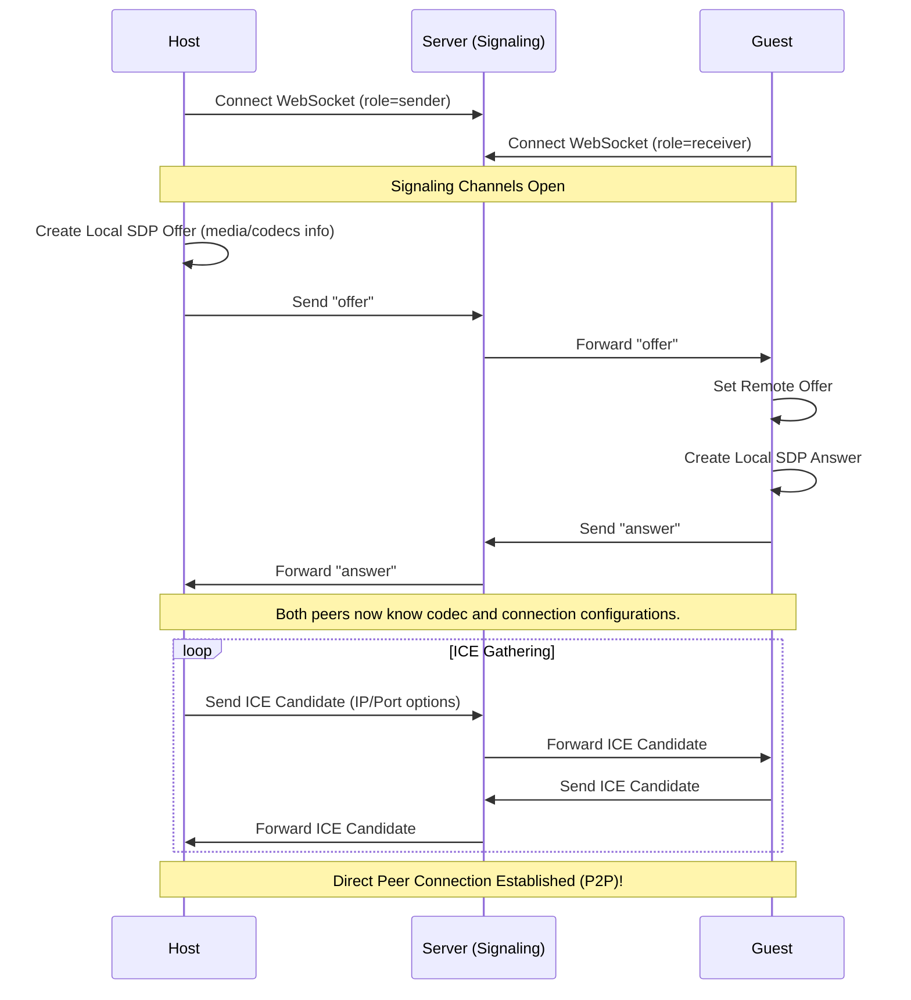

# Learning Guide: WebSockets & WebRTC in Spring Boot 4 (Java 25)

This guide is designed for developers who are already familiar with the basics of **Spring Boot (Spring MVC)**, **Thymeleaf**, and **JavaScript**, but have never used **WebSockets** or **WebRTC**.

By the end of this guide, you will understand:
1. What WebSockets are, and how they differ from standard HTTP.
2. How to implement WebSockets in Java 25 **without Spring** vs. **with Spring Boot**.
3. How to use JavaScript's native WebSocket client and its alternatives.
4. The mechanics of **WebRTC** (bi-directional vs. single-direction media streams, ICE candidates, and SDP).
5. The complete signaling flow of this application.

---

## 1. What is a WebSocket?

In standard web development (HTTP), the communication pattern is **request-response** (initiated by the client):

```
Client (Browser) --------[ HTTP GET /index ]--------> Server
Client (Browser) <-------[ HTTP 200 OK HTML ]------- Server
```

If the server has new data, it cannot send it to the client until the client requests it. Developers used to solve this with *polling* (asking the server every few seconds if there is new data), which is highly inefficient.

**WebSockets** provide a persistent, **full-duplex** (bi-directional), single-TCP-connection channel:

```
Client (Browser) --------[ HTTP Upgrade Handshake ]--> Server
Client (Browser) <-------[ 101 Switching Protocols ]-- Server
                 ============= ESTABLISHED =============
Client (Browser) <=======[ Bi-directional Frame ]=======> Server
```

Once the connection is established, either the client or the server can push a message (called a **Frame**) at any time.

---

## 2. WebSockets in Java 25 (Without Spring)

If you were writing a WebSocket server in Java 25 without the Spring Framework, you would use the standard **Jakarta WebSocket API** (formerly Java WebSocket API).

### How it works:
1. You deploy your application to a Servlet container (like Apache Tomcat, Jetty, or Undertow) that supports the Jakarta WebSocket specification.
2. You write a class annotated with `@ServerEndpoint` and use lifecycle annotations:

```java
import jakarta.websocket.*;
import jakarta.websocket.server.ServerEndpoint;
import java.io.IOException;
import java.util.concurrent.ConcurrentHashMap;

@ServerEndpoint("/chat/signal")
public class RawWebSocketServer {

    // Thread-safe session registry
    private static final ConcurrentHashMap<String, Session> sessions = new ConcurrentHashMap<>();

    @OnOpen
    public void onOpen(Session session) {
        sessions.put(session.getId(), session);
        System.out.println("New WebSocket session opened: " + session.getId());
    }

    @OnMessage
    public void onMessage(String message, Session session) throws IOException {
        System.out.println("Received message: " + message);
        // Broadcast to all other sessions
        for (Session activeSession : sessions.values()) {
            if (!activeSession.getId().equals(session.getId())) {
                activeSession.getBasicRemote().sendText(message);
            }
        }
    }

    @OnClose
    public void onClose(Session session) {
        sessions.remove(session.getId());
        System.out.println("Session closed: " + session.getId());
    }

    @OnError
    public void onError(Session session, Throwable throwable) {
        System.err.println("Error on session " + session.getId() + ": " + throwable.getMessage());
    }
}
```

### Why doing this without Spring is harder:
* **Dependency Injection Clashes:** Jakarta WebSocket endpoints are managed by the container (Tomcat), not Spring. Injecting Spring-managed beans (like databases or services) into a `@ServerEndpoint` class requires custom configurators (`SpringConfigurator`).
* **No Spring Features out-of-the-box:** You lose access to Spring security, automated exceptions mapping, interceptors, and CORS configuration.

---

## 3. How Spring Boot Simplifies WebSockets

Spring provides a cleaner, cohesive abstraction called the `WebSocketHandler` interface. You don't have to deal with container-specific endpoints.

### Step 1: Create a Handler Class
Instead of annotations, you extend a handler like `TextWebSocketHandler`:

```java
import org.springframework.web.socket.TextMessage;
import org.springframework.web.socket.WebSocketSession;
import org.springframework.web.socket.handler.TextWebSocketHandler;

public class MySignalHandler extends TextWebSocketHandler {

    @Override
    public void afterConnectionEstablished(WebSocketSession session) {
        // Run when a client connects
    }

    @Override
    protected void handleTextMessage(WebSocketSession session, TextMessage message) {
        // Run when a client sends a message
        String payload = message.getPayload();
    }

    @Override
    public void afterConnectionClosed(WebSocketSession session, CloseStatus status) {
        // Run when a client disconnects
    }
}
```

### Step 2: Register and Map the Endpoint
You register the handler using a config class implementing `WebSocketConfigurer`:

```java
import org.springframework.context.annotation.Configuration;
import org.springframework.web.socket.config.annotation.*;

@Configuration
@EnableWebSocket
public class WebSocketConfig implements WebSocketConfigurer {

    private final MySignalHandler mySignalHandler;

    public WebSocketConfig(MySignalHandler mySignalHandler) {
        this.mySignalHandler = mySignalHandler;
    }

    @Override
    public void registerWebSocketHandlers(WebSocketHandlerRegistry registry) {
        registry.addHandler(mySignalHandler, "/chat/signal")
                .setAllowedOrigins("*"); // Crucial for cross-origin hosting (like Cloud Run)
    }
}
```

### Spring's Key Advantages:
1. **Full DI Support:** The handler is a standard Spring `@Component`, meaning you can easily `@Autowired` databases, rooms, or other beans.
2. **CORS Handling:** You can easily chain `.setAllowedOrigins("*")` or restrict it to specific domains.
3. **Robust Handshake Interceptors:** You can intercept the handshake request to inspect headers, cookies, or authenticate the user before upgrading.

> [!CAUTION]
> **Thread Safety Warning:** Spring `WebSocketSession` instances are **not thread-safe**. If you try to send messages to the same session simultaneously from two different threads, Tomcat will throw a `java.lang.IllegalStateException: Message will not be sent because the WebSocket session has been closed` (or concurrent write exception). Always synchronize writes to sessions:
> ```java
> synchronized (session) {
>     session.sendMessage(new TextMessage(payload));
> }
> ```

---

## 4. Client-side WebSockets in JavaScript

Browsers support WebSockets natively without any external dependencies.

### Native JavaScript Usage:
```javascript
// 1. Establish the connection (uses ws:// or wss:// protocols)
const socket = new WebSocket("wss://yourdomain.com/chat/signal?room=123");

// 2. Handle connection opened
socket.onopen = (event) => {
    console.log("Connected to WebSocket server!");
    socket.send(JSON.stringify({ type: "join", user: "host" }));
};

// 3. Handle messages incoming from the server
socket.onmessage = (event) => {
    const data = JSON.parse(event.data);
    console.log("Received data:", data);
};

// 4. Handle errors
socket.onerror = (error) => {
    console.error("WebSocket error:", error);
};

// 5. Handle connection closed
socket.onclose = (event) => {
    console.log("Disconnected from server");
};
```

### Alternative Recommended Client Libraries:
If you require more than raw frames, consider these popular choices:
1. **StompJS / SockJS:** 
   * *What it does:* STOMP (Simple Text Oriented Messaging Protocol) sits on top of WebSockets. It structures messages with destinations (e.g., `/topic/messages`, `/app/send`). SockJS provides fallback options (like HTTP long-polling) if WebSockets are blocked by proxies.
2. **Socket.io (Node ecosystem):**
   * *What it does:* Highly popular, handles auto-reconnection, heartbeat checks, and fallback mechanisms. *Note:* Requires a specialized Java library (like Netty-SocketIO) on the backend since it doesn't use standard raw WebSocket protocol under the hood.

---

## 5. WebRTC Deep Dive

WebSockets allow clients to talk to the server. **WebRTC** (Web Real-Time Communication) allows clients to talk **directly to each other (Peer-to-Peer - P2P)**.

```
[Host Browser] <============ P2P Direct Media/Data Stream ============> [Guest Browser]
```

### Why do we need the Server (Signaling) then?
Before two browsers can connect directly, they don't know each other's IP addresses, firewall configurations, or media settings. They use the **WebSocket server** as a relay ("Signaling Server") to exchange this bootstrap data. Once bootstrap data is exchanged, the WebSocket connection goes quiet, and the media/data flows directly between the browsers.

### The Signaling Flow (SDP & ICE):


### WebRTC Concepts:
1. **SDP (Session Description Protocol):** A text format describing media capabilities (video codec, audio sample rate, resolution). One peer sends an **Offer**, the other responds with an **Answer**.
2. **ICE Candidates (Interactive Connectivity Establishment):** Your computer's public IP address, local IP address, and port numbers. Peers send these candidate paths to find the most direct way to bypass firewalls and connect.
3. **STUN/TURN Servers:**
   * **STUN:** Helps a browser find out its own public IP address and port.
   * **TURN:** If firewalls block a direct P2P connection, TURN servers act as a relay for the media.

---

## 6. Single-Direction vs. Bi-Directional WebRTC

WebRTC is highly flexible. Depending on the architecture, you can configure how media tracks are added to the `RTCPeerConnection`:

### Bi-Directional WebRTC (Video Calls / Chats)
Both participants add their microphone and camera tracks to the connection.

```javascript
// Both peers execute this code:
const localStream = await navigator.mediaDevices.getUserMedia({ video: true, audio: true });

// Add local media tracks to peer connection
localStream.getTracks().forEach(track => {
    peerConnection.addTrack(track, localStream);
});

// Listen for remote peer's tracks and render them
peerConnection.ontrack = (event) => {
    remoteVideo.srcObject = event.streams[0];
};
```
* **Result:** Both Host and Guest send and receive streams simultaneously.

### Single-Direction WebRTC (Broadcasting / Streaming)
One peer (Host) sends media, while the other peer (Guest) only receives.

```javascript
// Host (Sender) adds tracks:
localStream.getTracks().forEach(track => {
    peerConnection.addTrack(track, localStream);
});

// Guest (Receiver) DOES NOT call getUserMedia(). They only listen:
peerConnection.ontrack = (event) => {
    remoteVideo.srcObject = event.streams[0];
};
```
* **Result:** The host streams their camera to the guest, but the guest's camera is not shared. This reduces bandwidth requirements and is ideal for presentation/broadcasting modes.

---

## 7. WebRTC Data Channels (Sending Files & Chat Messages)

WebRTC is not limited to media. You can open direct, high-speed binary channels between browsers called `RTCDataChannel`.

### Setting up a Data Channel:
```javascript
// 1. Host creates the data channel before generating the SDP Offer
const chatChannel = peerConnection.createDataChannel("chat-channel");

chatChannel.onopen = () => console.log("Chat data channel is open!");
chatChannel.onmessage = (event) => console.log("Received text message:", event.data);

// 2. Guest receives the data channel event automatically
peerConnection.ondatachannel = (event) => {
    const receiveChannel = event.channel;
    receiveChannel.onmessage = (event) => {
        console.log("Received:", event.data);
    };
};
```

### Sending Files:
To transfer files without going through a server:
1. Use the HTML5 File API (`FileReader`) to read a file as an `ArrayBuffer`.
2. Slice the file into smaller byte chunks (e.g., 16KB).
3. Send the bytes over the channel: `dataChannel.send(chunk)`.
4. Re-assemble the buffer on the receiver side, create a `Blob`, and trigger a local download.
